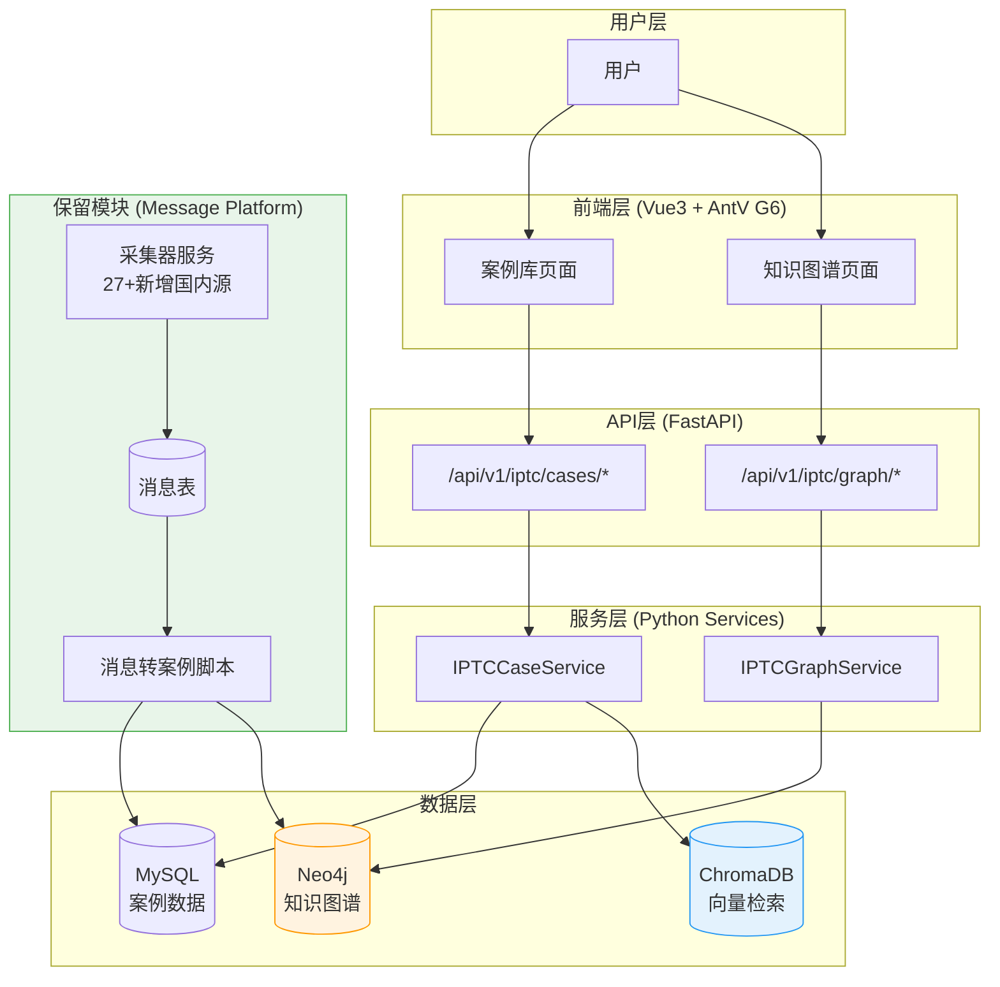
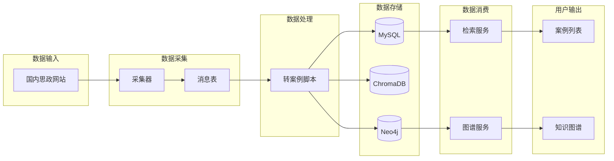

# AI赋能思政课网站 - 项目改造方案

> **基于 Message Platform 项目增量改造**
> **目标**:构建思政案例库与知识图谱展示网站
> **改造原则**:保留现有后端和前端代码,增量新增思政模块,新建独立前端

---

# 第二部分:项目规划

## 一、项目建模

### 1.1 系统整体逻辑模型

本系统采用**增量改造**的方式,在现有 Message Platform 基础上扩展思政案例库与知识图谱能力。系统的核心逻辑可以描述为一个**三层架构模型**:

**第一层:数据采集层**
数据采集层负责从国内思政类网站自动采集新闻资讯。新增的采集器继承现有的`PlaywrightCollectorBase`,按照统一架构实现。采集的消息存储到MySQL数据库,并同步到ChromaDB向量库以支持语义检索。

**第二层:案例处理层**
案例处理层负责将采集的消息转化为教学案例。转化流程包括:消息筛选→案例生成→知识图谱关联。案例数据存储在MySQL的iptc_cases表中,并通过Neo4j图数据库建立与知识点的关联关系。

**第三层:展示服务层**
展示服务层提供案例浏览和知识图谱可视化两大功能。案例浏览采用类似global前端的卡片列表形式,支持关键词搜索和分页。知识图谱使用AntV G6库渲染,展示知识点之间的关联关系。

**数据流向逻辑**
1. **采集流**:国内思政网站→采集器→MySQL消息表→ChromaDB向量库
2. **案例生成流**:MySQL消息表→案例处理服务→iptc_cases表→Neo4j知识图谱
3. **展示流**:用户请求→API查询→MySQL/Neo4j→前端渲染

### 1.2 微服务架构模型

系统采用微服务架构,每个功能模块作为独立服务运行,通过API接口通信。

```
┌─────────────────────────────────────────────────────────────┐
│                    前端展示层(独立部署)                      │
│     ┌──────────────────┐   ┌──────────────────┐            │
│     │  案例库前端       │   │ 知识图谱前端      │            │
│     │ (案例搜索展示)    │   │ (图谱可视化)      │            │
│     └────────┬─────────┘   └────────┬─────────┘            │
└──────────────┼──────────────────────┼──────────────────────┘
               │                      │
               ▼                      ▼
┌─────────────────────────────────────────────────────────────┐
│                    API网关层 (FastAPI)                       │
│           /api/v1/iptc/cases/*    /api/v1/iptc/graph/*      │
└───────┬──────────────────────────────┬─────────────────────┘
        │                              │
        ▼                              ▼
┌──────────────────┐          ┌──────────────────┐
│  案例库服务模块   │          │ 知识图谱服务模块  │
│   (M1)           │          │   (M2)           │
├──────────────────┤          ├──────────────────┤
│MySQL + ChromaDB  │          │    Neo4j         │
└──────────────────┘          └──────────────────┘

┌─────────────────────────────────────────────────────────────┐
│              保留模块 (Message Platform)                     │
│  ┌──────────────┐ ┌──────────────┐ ┌──────────────┐        │
│  │采集器服务    │ │消息表        │ │global前端    │        │
│  │(27个现有源)  │ │(MySQL)       │ │(保留不动)    │        │
│  └──────────────┘ └──────────────┘ └──────────────┘        │
└─────────────────────────────────────────────────────────────┘
```

---

## 二、模块细表

### 模块M1:案例库服务模块

**职责**:
- 管理案例的读取操作(仅查询,不包含编辑)
- 提供案例检索(关键词搜索)
- 提供消息到案例的转化流程

**对应需求**:N2(案例库检索与展示)、N3(消息采集器扩展)

**具体实现思路**:

案例库服务模块负责案例的展示与检索,是系统的核心展示模块。该模块的实现包含三个关键部分:

第一部分是**ORM实体设计**。在`backend/database/entities.py`中新增`IPTCCase`类,包含`id, title, content, summary, source_url, tags, published_at, created_at`字段。这是一个只读数据表,案例数据通过后台脚本从消息表转化而来。

第二部分是**案例查询服务**。创建`backend/services/iptc_case_service.py`,实现`IPTCCaseService`类。核心方法包括:`get_cases(keyword, page, size)`分页查询案例;`get_case_by_id(case_id)`获取案例详情;`search_cases_semantic(query, top_k)`语义检索案例(通过ChromaDB)。所有方法均为只读查询,不提供写入能力。

第三部分是**智能案例生成流程**。这是系统的核心创新点,采用渐进式优化的智能匹配方案,自动将采集的消息转化为教学案例。该流程分为以下阶段:

**阶段1:构建思政知识点向量知识库(前置准备)**
- 收集整理思政教材中的核心知识点(如"高质量发展"、"共同富裕"、"乡村振兴"等)
- 为每个知识点编写标准描述和关键词
- 使用LLM的Embedding能力将知识点向量化
- 存储到ChromaDB独立collection(命名为`iptc_knowledge_points`)
- 在Neo4j中创建知识点节点,建立知识点之间的关联关系

**阶段2:批量消息撞库机制(基础方案)**
- 监控国内思政消息源的新消息数量
- 当积攒到200条新消息时,触发批量撞库任务
- 撞库流程:
  1. 读取200条新消息,提取`title + content`进行向量化
  2. 使用ChromaDB对`iptc_knowledge_points`进行相似度检索
  3. 设置相似度阈值为0.6,筛选出匹配的知识点
  4. 统计每个知识点关联的消息数量
  5. 当某个知识点(如"高质量发展")关联消息数>=7条时,触发案例生成
- 案例生成逻辑:
  1. 提取该知识点关联的所有消息(>=7条)
  2. 调用LLM进行案例摘要生成(综合多条消息内容)
  3. 生成结构化案例:`{title, content, summary, related_knowledge_point, source_messages[]}`
  4. 写入`iptc_cases`表
  5. 向量化并存入ChromaDB的`iptc_cases` collection
  6. 在Neo4j中创建Case节点,建立Case→KnowledgePoint的RELATES_TO关系
- 批量撞库脚本:`backend/scripts/batch_match_cases.py`
- 通过Celery定时任务执行(每小时检查一次新消息数量)

**阶段3:GraphRAG增强(优化方案)**
- 在批量撞库基础上,引入GraphRAG技术增强案例生成质量
- GraphRAG流程:
  1. 不仅检索知识点本身,还检索知识点的关联节点(上下文知识点)
  2. 通过Neo4j图查询,获取知识点的邻居节点(如"高质量发展"→"新发展理念"→"创新驱动")
  3. 将图谱上下文注入LLM Prompt,生成更具体系性的案例
  4. 案例中标注多层级知识点关联
- GraphRAG实现:`backend/services/graph_rag_service.py`
- 优势:生成的案例不仅关联单一知识点,还能体现知识点之间的逻辑关系

**阶段4:实时打标机制(备选方案)**
- 如果批量方案效果不理想,切换为实时打标机制
- 实时打标流程:
  1. 每条消息采集完成后,立即进行知识点向量匹配
  2. 为每条消息打上最贴近的3个知识点标签(Top3相似度)
  3. 在消息表新增字段:`knowledge_tags` (JSON格式,存储`[{kp_id, kp_name, similarity}]`)
  4. 实时统计每个知识点的打标计数
  5. 当某个知识点打标数>=7时,触发案例生成
- 实时打标优势:响应速度快,不需要等待积攒200条
- 实时打标脚本:`backend/scripts/realtime_tag_messages.py`
- 集成到采集器流程中:`collector._collect_once()`完成后自动调用打标服务

**实施优先级**:
1. 先实现阶段1+阶段2(知识点库+批量撞库),验证基础可行性
2. 如果效果良好,引入阶段3(GraphRAG)提升质量
3. 如果批量方案响应速度不够,切换到阶段4(实时打标)

**关键参数配置**:
- 批量触发阈值:`BATCH_SIZE = 200`
- 相似度阈值:`SIMILARITY_THRESHOLD = 0.6`
- 案例生成阈值:`CASE_GENERATION_THRESHOLD = 7`
- 实时打标Top K:`REALTIME_TAG_TOP_K = 3`

**技术栈**:
- MySQL 8.0(关系数据库)
- ChromaDB(向量数据库,复用现有)
- SQLAlchemy 2.0(ORM)
- FastAPI(API路由)

---

### 模块M2:知识图谱服务模块

**职责**:
- 管理Neo4j图数据库连接
- 提供图谱数据的查询操作
- 向前端提供图谱可视化所需的节点和边数据

**对应需求**:N1(知识图谱可视化浏览)

**具体实现思路**:

知识图谱服务模块负责知识网络的存储与查询。该模块的实现分为三个关键部分:

第一部分是**Neo4j客户端封装**。创建`backend/graph/neo4j_client.py`,封装Neo4j官方Python驱动的连接管理。该类采用单例模式,在应用启动时初始化连接池,提供`run_query()`方法执行Cypher查询,并自动处理事务和连接释放。

第二部分是**图谱数据模型设计**。在Neo4j中,我们定义两种节点类型:KnowledgePoint(知识点)、Case(案例)。节点之间通过RELATES_TO边类型连接,表示案例引用知识点的关系。节点的属性与MySQL表字段对应,通过`id`字段实现双向映射。

第三部分是**图谱查询服务**。创建`backend/services/iptc_graph_service.py`,实现`IPTCGraphService`类。核心方法:`get_full_graph()`获取完整图谱(限制节点数量500个以内);`get_case_relations(case_id)`获取某案例关联的所有知识点。查询结果转换为前端AntV G6所需的`{nodes: [], edges: []}`格式返回。

**技术栈**:
- Neo4j 5.x(图数据库)
- neo4j Python Driver 5.14.0
- FastAPI(API路由)

---

### 模块M3:消息采集器模块(扩展)

**职责**:
- 保留现有27个消息源采集器
- 新增国内思政类消息源采集器

**对应需求**:N3(消息采集器扩展)

**具体实现思路**:

消息采集器模块完全保留现有架构,仅新增国内思政类采集器。该模块的扩展策略如下:

第一部分是**完整保留现有代码**。保留`backend/collectors/`目录(采集器基础设施)、`backend/sources/`目录(27个消息源采集器)、`backend/services/collector_service.py`(采集器调度服务)、`backend/services/browser_pool.py`(浏览器池服务)、`backend/tasks/`目录(Celery任务)。所有现有采集器继续正常运行,不做任何修改。

第二部分是**新增国内思政消息源采集器**。在`backend/sources/`目录下新增以下采集器:
- 人民网理论频道(`people_theory`)
- 求是网(`qstheory`)
- 光明网理论频道(`gmw_theory`)
- 中国社会科学网(`cssn`)

新采集器继承`PlaywrightCollectorBase`,实现`_collect_once()`方法。采集的消息存储到对应的消息表(如`mp_people_theory_messages`、`mp_qstheory_messages`等),遵循现有的统一字段标准。

第三部分是**数据库表注册**。为每个新增消息源创建对应的消息表和register.sql脚本,注册到mp_message_sources表,配置chroma_collection名称。

**技术栈**:
- 保留现有全部技术栈(Playwright、Celery等)

---

### 模块M4:前端展示模块(新建)

**职责**:
- 案例库浏览和检索界面
- 知识图谱可视化界面

**对应需求**:N1、N2(全部前端相关需求)

**具体实现思路**:

前端展示模块负责用户界面的呈现,采用Vue3 + TypeScript技术栈,**新建独立的前端项目**,不删除或修改现有的global-news-dashboard。该模块的实现分为两个核心页面:

**重要说明**:global-news-dashboard前端保持原样,完全不动。新建一个独立的前端项目文件夹`iptc-dashboard`,与`global-news-dashboard`并列。

第一部分是**案例库页面**(`views/Cases/`)。该页面提供案例的浏览和检索功能,参照global前端的Messages页面设计。顶部为搜索栏,支持关键词输入。主体为案例卡片列表,使用Element Plus的Card组件,展示标题、摘要、标签、发布时间,卡片布局类似global前端的消息列表。底部为分页组件。点击卡片跳转到案例详情页,详情页展示完整正文(使用MarkdownRenderer组件渲染),右侧展示该案例关联的知识点列表。

第二部分是**知识图谱页面**(`views/KnowledgeGraph/`)。该页面是系统的核心可视化界面,使用AntV G6图谱库渲染知识网络。页面结构为左侧图谱画布、右侧详情面板。图谱数据通过`/api/v1/iptc/graph/full`接口获取,格式为`{nodes: [{id, label, type, ...}], edges: [{source, target, type}]}`。G6配置使用Force布局(力导向布局),不同类型节点使用不同颜色(知识点-绿色、案例-橙色)。支持节点点击事件,触发详情面板更新,展示节点的标题和内容。支持缩放、平移交互。

**目录结构**:
```
message_platform/
├── backend/                      # 后端(保留+新增)
├── global-news-dashboard/        # 现有前端(完全保留,不修改)
└── iptc-dashboard/               # 新建思政课前端
    ├── src/
    │   ├── views/
    │   │   ├── Cases/            # 案例库页面
    │   │   │   ├── index.vue
    │   │   │   ├── CaseList.vue
    │   │   │   └── CaseDetail.vue
    │   │   └── KnowledgeGraph/   # 知识图谱页面
    │   │       ├── index.vue
    │   │       └── GraphCanvas.vue
    │   ├── components/
    │   │   ├── common/
    │   │   │   └── MarkdownRenderer.vue
    │   │   └── case/
    │   │       └── CaseCard.vue
    │   ├── api/
    │   │   ├── index.ts
    │   │   ├── case.ts
    │   │   └── graph.ts
    │   ├── router/
    │   │   └── index.ts
    │   └── types/
    │       ├── case.ts
    │       └── graph.ts
    ├── package.json
    └── vite.config.ts
```

**技术栈**:
- Vue 3 + TypeScript
- AntV G6 4.8.0(图谱可视化)
- Element Plus(UI组件库)
- Pinia(状态管理)
- Axios(HTTP请求)
- Vite(构建工具)

---

## 三、项目整体架构

### 3.1 项目-用户动线图



### 3.2 数据流向图



---

## 四、目录结构(改造后)

### 4.1 后端目录(增量新增)

```
message_platform/backend/
├── main.py                      # FastAPI主入口(修改:注册新路由)
├── config/                      # 配置管理(保留)
├── database/                    # 数据库层
│   ├── connection.py            # (保留)MySQL连接
│   ├── entities.py              # (修改)新增IPTCCase等ORM类
│   └── orm_registry.py          # (保留)
├── graph/                       # 【新增】图数据库层
│   ├── __init__.py
│   └── neo4j_client.py          # Neo4j客户端封装
├── services/                    # 业务层
│   ├── collector_service.py     # (保留)采集器服务
│   ├── browser_pool.py          # (保留)浏览器池
│   ├── iptc_case_service.py     # 【新增】案例服务
│   └── iptc_graph_service.py    # 【新增】图谱服务
├── api/                         # API层
│   ├── search_routes.py         # (保留)
│   ├── source_routes.py         # (保留)
│   ├── iptc_case_routes.py      # 【新增】案例API
│   └── iptc_graph_routes.py     # 【新增】图谱API
├── collectors/                  # (保留)采集器基础设施
├── sources/                     # (保留+新增)
│   ├── people_theory/           # 【新增】人民网理论频道
│   ├── qstheory/                # 【新增】求是网
│   ├── gmw_theory/              # 【新增】光明网理论频道
│   └── cssn/                    # 【新增】中国社会科学网
├── llm/                         # (保留)LLM服务
├── storage/                     # (保留)向量存储
├── tasks/                       # (保留)Celery任务
└── scripts/                     # 脚本
    ├── (保留现有脚本)
    ├── convert_messages_to_cases.py  # 【新增】消息转案例脚本
    └── build_knowledge_graph.py      # 【新增】图谱构建脚本
```

### 4.2 前端目录(新建独立项目)

```
message_platform/
├── global-news-dashboard/       # 现有前端(完全保留,不修改)
└── iptc-dashboard/              # 【新建】思政课前端
    ├── src/
    │   ├── views/
    │   │   ├── Cases/           # 案例库页面
    │   │   │   ├── index.vue
    │   │   │   ├── CaseList.vue
    │   │   │   └── CaseDetail.vue
    │   │   └── KnowledgeGraph/  # 知识图谱页面
    │   │       ├── index.vue
    │   │       └── GraphCanvas.vue
    │   ├── components/
    │   │   ├── common/
    │   │   │   └── MarkdownRenderer.vue
    │   │   └── case/
    │   │       └── CaseCard.vue
    │   ├── api/
    │   │   ├── index.ts
    │   │   ├── case.ts
    │   │   └── graph.ts
    │   ├── stores/
    │   │   ├── index.ts
    │   │   └── case.ts
    │   ├── router/
    │   │   └── index.ts
    │   └── types/
    │       ├── case.ts
    │       └── graph.ts
    ├── package.json
    ├── vite.config.ts
    └── README.md
```

---

## 五、配置文件调整

### 5.1 config.yaml 新增配置

```yaml
# 现有配置保留不变

# 【新增】Neo4j配置
neo4j:
  uri: "${NEO4J_URI:bolt://localhost:7687}"
  username: "${NEO4J_USER:neo4j}"
  password: "${NEO4J_PASSWORD:password}"
  database: "${NEO4J_DATABASE:neo4j}"
  max_connection_lifetime: 3600
  max_connection_pool_size: 50

# 【新增】思政课配置
iptc:
  enable_auto_convert: true
  convert_interval_hours: 24
  case_min_length: 200
```

### 5.2 requirements.txt 新增依赖

```
# 现有依赖保留不变

# 【新增】Neo4j相关
neo4j==latest
```

### 5.3 package.json 新增依赖(iptc-dashboard)

```json
{
  "name": "iptc-dashboard",
  "version": "1.0.0",
  "dependencies": {
    "vue": "latest",
    "element-plus": "latest",
    "@antv/g6": "latest",
    "pinia": "latest",
    "axios": "latest"
  }
}
```

---

## 六、数据库新增表

### 6.1 MySQL新增表

```sql
-- 案例表
CREATE TABLE iptc_cases (
    id VARCHAR(36) PRIMARY KEY,
    title VARCHAR(500) NOT NULL,
    content TEXT NOT NULL,
    summary TEXT,
    source_url VARCHAR(500),
    tags TEXT,
    related_knowledge_points JSON COMMENT '关联的知识点列表,格式:[{id,name,similarity}]',
    source_message_ids JSON COMMENT '来源消息ID列表',
    published_at DATETIME,
    created_at DATETIME DEFAULT CURRENT_TIMESTAMP,
    INDEX idx_published_at (published_at)
);

-- 知识点统计表(用于批量撞库机制)
CREATE TABLE iptc_knowledge_point_stats (
    id VARCHAR(36) PRIMARY KEY,
    knowledge_point_id VARCHAR(36) NOT NULL COMMENT '知识点ID',
    knowledge_point_name VARCHAR(200) NOT NULL COMMENT '知识点名称',
    matched_message_count INT DEFAULT 0 COMMENT '匹配的消息数量',
    case_generated TINYINT DEFAULT 0 COMMENT '是否已生成案例(0:否,1:是)',
    last_matched_at DATETIME COMMENT '最后一次匹配时间',
    created_at DATETIME DEFAULT CURRENT_TIMESTAMP,
    updated_at DATETIME DEFAULT CURRENT_TIMESTAMP ON UPDATE CURRENT_TIMESTAMP,
    UNIQUE KEY uk_kp_id (knowledge_point_id),
    INDEX idx_message_count (matched_message_count),
    INDEX idx_case_generated (case_generated)
);

-- 消息-知识点关联表(用于批量撞库和实时打标)
CREATE TABLE iptc_message_knowledge_relations (
    id VARCHAR(36) PRIMARY KEY,
    message_id VARCHAR(36) NOT NULL COMMENT '消息ID',
    source_table VARCHAR(100) NOT NULL COMMENT '消息来源表名',
    knowledge_point_id VARCHAR(36) NOT NULL COMMENT '知识点ID',
    knowledge_point_name VARCHAR(200) NOT NULL COMMENT '知识点名称',
    similarity_score DECIMAL(5,4) NOT NULL COMMENT '相似度分数(0-1)',
    created_at DATETIME DEFAULT CURRENT_TIMESTAMP,
    INDEX idx_message_id (message_id),
    INDEX idx_kp_id (knowledge_point_id),
    INDEX idx_similarity (similarity_score),
    UNIQUE KEY uk_msg_kp (message_id, knowledge_point_id)
);
```

**说明**:
- `iptc_cases.related_knowledge_points`: 存储案例关联的知识点,支持多知识点关联
- `iptc_knowledge_point_stats`: 统计每个知识点匹配的消息数,达到阈值7时触发案例生成
- `iptc_message_knowledge_relations`: 存储消息与知识点的匹配关系,支持批量撞库和实时打标两种方案

### 6.2 Neo4j图谱Schema

```cypher
// 创建索引
CREATE INDEX knowledge_point_id_index FOR (k:KnowledgePoint) ON (k.id);
CREATE INDEX case_id_index FOR (c:Case) ON (c.id);

// 创建约束
CREATE CONSTRAINT kp_id_unique FOR (k:KnowledgePoint) REQUIRE k.id IS UNIQUE;
CREATE CONSTRAINT case_id_unique FOR (c:Case) REQUIRE c.id IS UNIQUE;
```

---

## 七、API接口设计

### 7.1 新增API端点

```
# 案例查询
GET    /api/v1/iptc/cases                 # 获取案例列表(支持分页、关键词搜索)
GET    /api/v1/iptc/cases/{id}            # 获取案例详情

# 知识图谱
GET    /api/v1/iptc/graph/full            # 获取完整图谱
GET    /api/v1/iptc/graph/case/{id}       # 获取案例关联的知识点
```

---

## 八、实施计划

| 阶段 | 工作内容 | 关键任务 |
|------|---------|---------|
| **阶段1:后端新增国内消息源采集器** | 新增人民网理论频道、求是网、光明网理论频道、中国社会科学网4个采集器 | 1.创建采集器类<br>2.创建消息表<br>3.注册到mp_message_sources<br>4.测试采集功能 |
| **阶段2:制作并接入知识图谱** | 构建Neo4j知识图谱,建立知识点数据基础 | 1.安装配置Neo4j<br>2.收集整理思政知识点<br>3.构建知识点向量库(ChromaDB collection: iptc_knowledge_points)<br>4.在Neo4j中创建知识点节点和关联关系<br>5.实现IPTCGraphService |
| **阶段3:智能案例生成流程(本阶段在阶段1+2完成后实施)** | 实现基于向量撞库的智能案例生成 | **步骤3.1:批量撞库机制**<br>1.编写batch_match_cases.py脚本<br>2.实现200条消息积攒监控<br>3.实现向量相似度检索(阈值0.6)<br>4.实现知识点打标统计(阈值7条)<br>5.实现LLM案例摘要生成<br>6.配置Celery定时任务<br>7.测试端到端流程<br><br>**步骤3.2:GraphRAG增强(可选)**<br>1.编写graph_rag_service.py<br>2.实现图谱上下文注入<br>3.优化案例生成Prompt<br>4.测试GraphRAG效果<br><br>**步骤3.3:实时打标机制(备选)**<br>1.如批量方案效果不佳,编写realtime_tag_messages.py<br>2.在消息表添加knowledge_tags字段<br>3.集成到采集器流程<br>4.实现实时打标计数统计<br>5.测试实时响应速度 |
| **阶段4:制作前端** | 新建iptc-dashboard前端项目,实现案例搜索展示和知识图谱渲染 | 1.初始化Vue3项目<br>2.开发案例库页面<br>3.开发知识图谱页面<br>4.联调测试 |

**预计总工时**:15-18天

---

**文档版本**:v3.0(精简版)
**生成日期**:2025-12-05
**文档路径**:`D:\AI-Empowered IPTC Website\思政课网站-项目规划.md`